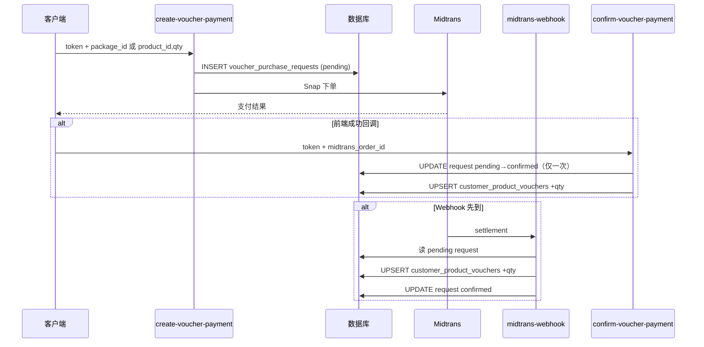

# 水票（按商品维度 Voucher）数据流说明

本文档基于仓库内 **Supabase 迁移** 与 **Edge Functions** 整理，供后端开发与对账参考。

---

## 核心表

| 表名 | 作用 |
|------|------|
| **`customer_product_vouchers`** | 客户每个 `products.id` 对应的水票张数。主键 `(customer_id, product_id)`，字段 **`balance`**（整数，≥0）。**购买入账、下单抵扣、取消退回均更新此表。** |
| **`voucher_purchase_requests`** | 单次「买水票」支付意图：客户、商品、数量、金额、`midtrans_order_id`、`status`（`pending` / `confirmed` / `rejected`）。用于对齐 Midtrans 订单并防止重复加票。 |
| **`voucher_packages`** | 套餐定义（`product_id`、`qty`、`price` 等），仅参与定价与写入 request，**不存储余额**。 |
| **`products`** | 商品主数据；水票按 **商品维度** 区分（不同规格/品类 = 不同 `product_id`）。 |

> **说明**：迁移中注明 **`customers.voucher_balance` 可能仍用于后台兼容**，但客户端业务以 **`customer_product_vouchers`** 为准，不应单独依赖旧字段维护水票余额。

---

## 1. 客户购买水票：付款成功后加在哪？

### 流程概览

1. **创建支付**（Edge Function：`create-voucher-payment`）
   - 生成 Midtrans 订单号：`vpc_{customer.id 前 8 位}_{时间戳}`。
   - **先** `INSERT` **`voucher_purchase_requests`**：`customer_id`、`product_id`、`qty`、`amount_paid`、`midtrans_order_id`、`status = 'pending'`。
   - 再调用 Midtrans Snap，客户完成支付。

2. **付款成功后的入账**（两条路径可能只执行其一或先后到达，通过 `pending` 状态防重）

   **路径 A — 前端成功回调**（`confirm-voucher-payment`）

   - 将 `midtrans_order_id` 匹配、且属于当前客户、**`status = 'pending'`** 的请求行 **`UPDATE` 为 `confirmed`**（仅首次成功；若已是 `confirmed` 则返回 `already_confirmed`，**不再增加 balance**）。
   - 对 **`customer_product_vouchers`** **`UPSERT`**：`balance = 原 balance + qty`。

   **路径 B — Midtrans Webhook**（`midtrans-webhook`）

   - 校验签名且支付成功后，若 `order_id` 以 **`vpc_`** 开头：
   - 查询 **`voucher_purchase_requests`**：`midtrans_order_id` 匹配且 **`status = 'pending'`**。
   - 若存在：**`customer_product_vouchers` UPSERT** 增加 `qty`，再将该请求 **`UPDATE` 为 `confirmed`**。

### 结论

| 问题 | 答案 |
|------|------|
| 水票加在哪个表？ | **`customer_product_vouchers`** 中对应 `(customer_id, product_id)` 行的 **`balance`**。 |
| `voucher_purchase_requests` 算什么？ | 支付意图与防重状态机；**不存放当前总余额**，只记录本次购买及 `pending` → `confirmed`。 |

### 时序图（Mermaid）

---

## 2. 客户使用水票：如何扣、扣在哪个表？

水票在 **提交订单** 时按购物车行对应的 **`product_id`** 扣减；**仅更新 `customer_product_vouchers`**。当前实现 **无独立「水票流水表」**；若需审计或对账，需在变更点外挂 ledger 表。

### 2a 预付客户（`customer_type = 'pre_pay'`）

**Edge Function：`submit-prepay-order`**

- 写入 **`orders`**（`payment_status = 'unpaid'`）、**`order_items`**。
- 若请求体包含 **`product_deductions`**：`[{ product_id, quantity }, ...]`：
  - 对每个条目：读取 **`customer_product_vouchers.balance`**，**`UPSERT`**：`balance = max(0, current - quantity)`。
- 再创建 Midtrans 订单（`pop_...`），**QRIS 只收扣完水票后的差额**。
- Webhook 中 `pop_` 仅将 **`orders.payment_status`** 更新为 `paid`，**不再动水票**（水票已在 submit 时扣除）。

### 2b 通用下单（含后付等）

**Edge Function：`submit-order`**

- 先校验：每个 `product_deductions` 的 `quantity` 不超过对应 **`customer_product_vouchers.balance`**。
- 写入 **`orders` / `order_items`** 后，同样循环 **`customer_product_vouchers` UPSERT** 完成扣减。

### 取消订单退回（补充）

**Edge Function：`cancel-order`**

- 在适用场景（如 pre_pay）下，将已扣的 **`product_deductions` 对应数量加回 `customer_product_vouchers`**。

### 结论

| 问题 | 答案 |
|------|------|
| 扣在哪个表？ | **`customer_product_vouchers`** 对应行的 **`balance`**。 |
| 订单表存水票余额吗？ | **不存**。订单用 **`orders` + `order_items`** 记录商品与金额；剩余水票只看 **`customer_product_vouchers`**。 |

---

## 后端实现检查清单

1. **余额唯一来源**：`customer_product_vouchers`（按 `product_id` 维度）。
2. **购票**：`voucher_purchase_requests`（`pending`）→ 支付成功 → **`customer_product_vouchers` +qty** + 请求 **`confirmed`**；`vpc_` 与 Webhook / confirm 配合防双加。
3. **用票**：`submit-prepay-order` / `submit-order` 接收 **`product_deductions`**，更新 **`customer_product_vouchers.balance`**。
4. **流水/对账**：当前代码无独立 ledger；若需要，在所有变更 `balance` 的路径上增加事务或旁路写入。

---

## 相关代码位置（便于跳转）

| 能力 | 路径 |
|------|------|
| 表结构 | `supabase/migrations/20260228200000_add_product_vouchers.sql`、`20260228210000_add_midtrans_payment.sql` |
| 创建水票支付 | `supabase/functions/create-voucher-payment/index.ts` |
| 前端确认入账 | `supabase/functions/confirm-voucher-payment/index.ts` |
| Webhook 入账 | `supabase/functions/midtrans-webhook/index.ts`（`vpc_` 分支） |
| 预付下单扣票 | `supabase/functions/submit-prepay-order/index.ts` |
| 通用下单扣票 | `supabase/functions/submit-order/index.ts` |
| 取消退回 | `supabase/functions/cancel-order/index.ts` |
